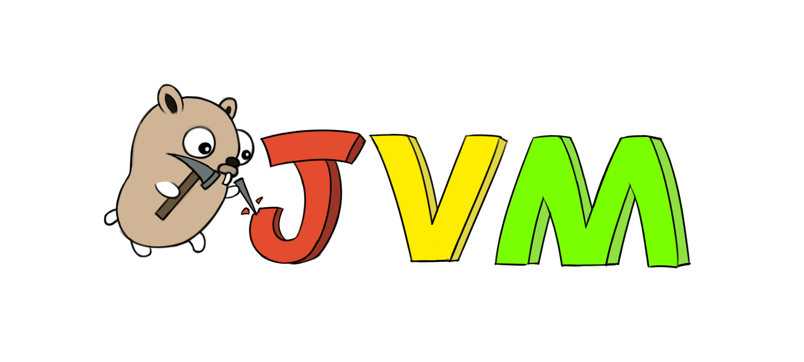

# jvm.go
A JVM written in Go.


# Introduction
jvm.go is a toy JVM (which is far from complete) programmed in Go. The main purpose of this project is learning Go and the JVM. So the number one goal of the project is readability of code. The basic idea is to just implement the core JVM, and use `rt.jar` (from OpenJDK) as its class library. The garbage collector is implemented by directly using Go’s GC. 

# My dev environment
  * Mac OS X 10.13.6
  * Java 1.8.0_201
  * Go 1.12

# Build jvm.go
```sh
git clone https://github.com/zxh0/jvm.go.git
cd jvm.go
go build github.com/zxh0/jvm.go/jvmgo/cmd/java
```

# Run jvm.go using your Java installation
Ensure your Java version is 1.8.0_32 and JAVA_HOME env was set
```sh
./java -XuseJavaHome -cp path/to/jars:path/to/classes HelloWorld
```

# Run jvm.go using Zulu
Download [zulu1.8.0_31-8.5.0.1-macosx.zip](http://www.azulsystems.com/products/zulu/downloads#mac) ([Zulu](http://www.azulsystems.com/products/zulu) is a certified build of OpenJDK that is fully compliant with the Java SE standard.) and unzip it to somewhere, Copy `jvm.go/java` into unzipped folder 
```sh
cd path/to/zulu1.8.0_31-8.5.0.1-macosx
cp path/to/jvm.go/java jvmgo
jvmgo -cp path/to/jars:path/to/classes HelloWorld
```

